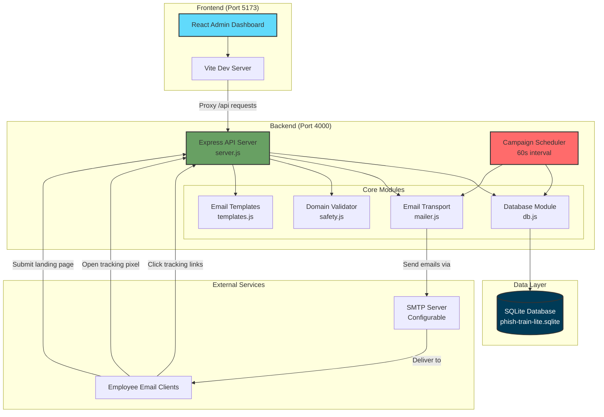
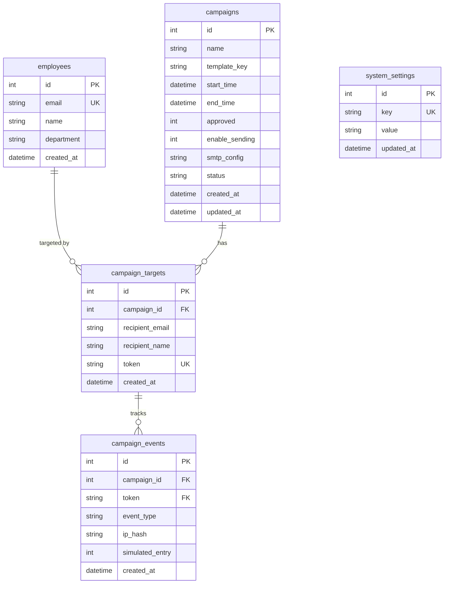
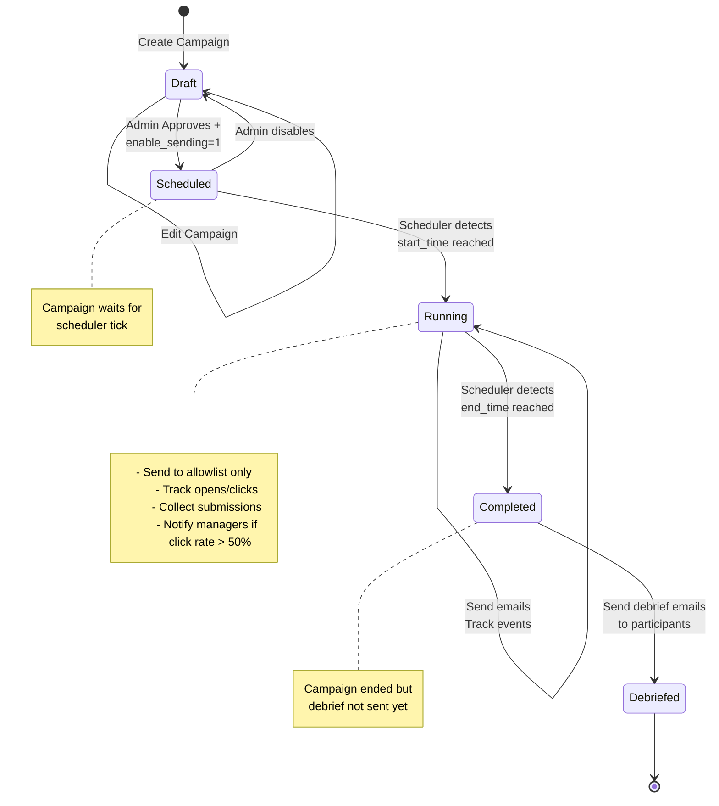
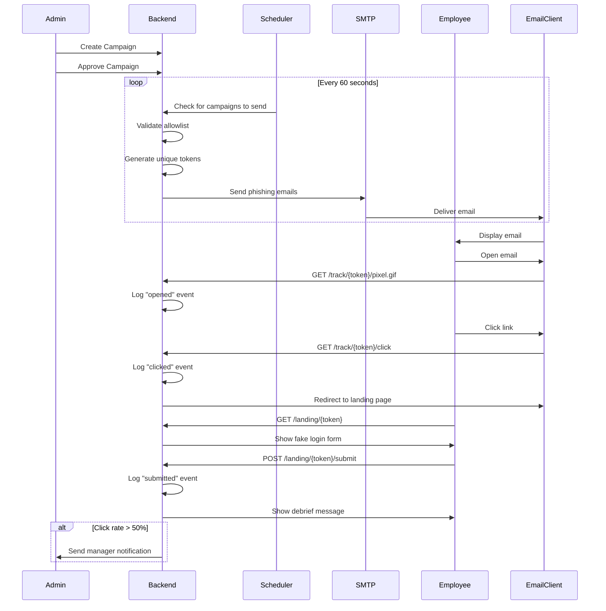
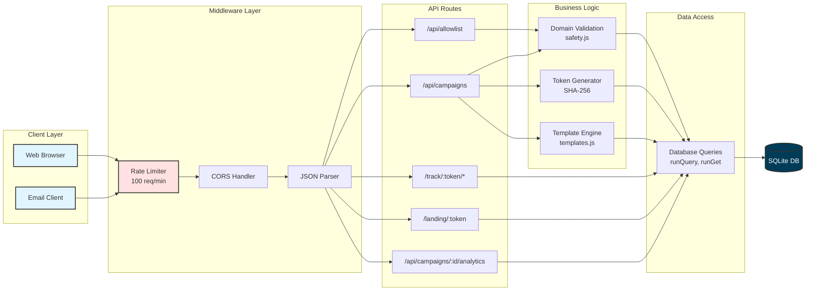
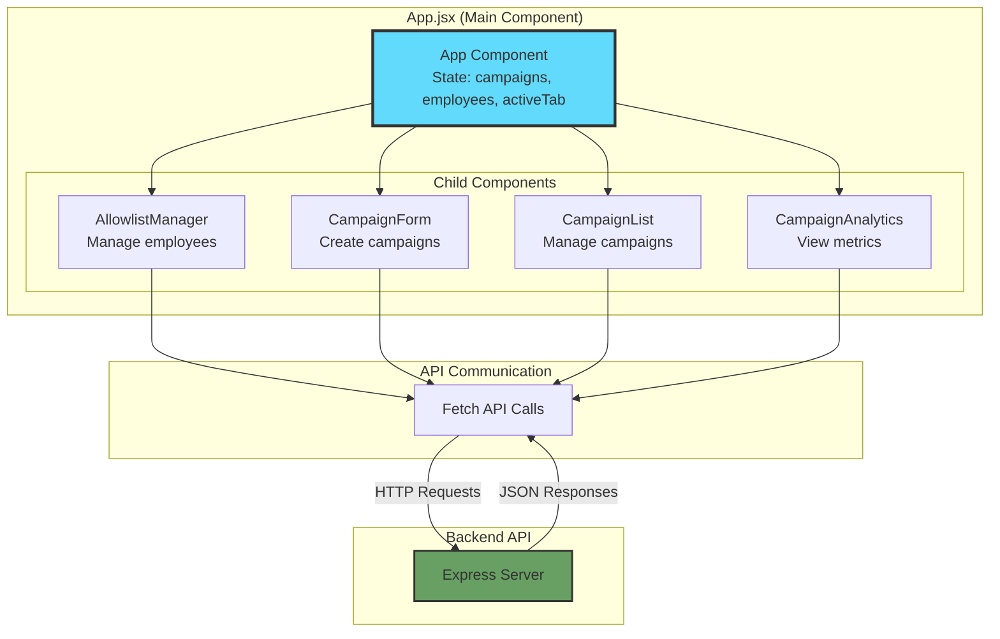
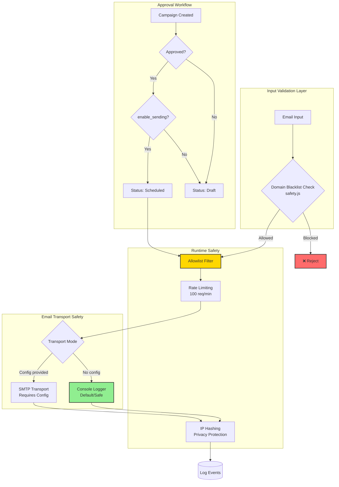
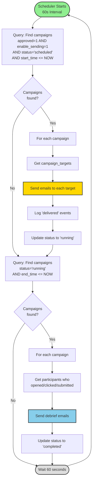

# Phish Train Lite - Architecture Diagrams

## 1. System Architecture Overview

## 2. Database Schema (ER Diagram)

## 3. Campaign Lifecycle Flow

## 4. Email Tracking Flow

## 5. Request Flow Architecture

## 6. Component Architecture (Frontend)

## 7. Security & Safety Architecture

## 8. Scheduler Architecture

## 9. Data Flow: Campaign Creation to Completion

```mermaid
flowchart LR
    subgraph "1. Campaign Setup"
        A1[Admin creates campaign] --> A2[Select template]
        A2 --> A3[Set schedule]
        A3 --> A4[Configure SMTP]
        A4 --> A5[Save as Draft]
    end

    subgraph "2. Approval"
        A5 --> B1{Admin approves?}
        B1 -->|No| A5
        B1 -->|Yes| B2[Set approved=1<br/>enable_sending=1]
        B2 --> B3[Status: Scheduled]
    end

    subgraph "3. Execution"
        B3 --> C1[Scheduler detects<br/>start_time reached]
        C1 --> C2[Generate tokens<br/>for each target]
        C2 --> C3[Send emails]
        C3 --> C4[Status: Running]
    end

    subgraph "4. Tracking"
        C4 --> D1[Track opens<br/>pixel.gif]
        C4 --> D2[Track clicks<br/>redirect]
        C4 --> D3[Track submissions<br/>landing page]
        D1 --> D4[(Store events)]
        D2 --> D4
        D3 --> D4
    end

    subgraph "5. Analytics"
        D4 --> E1[Calculate metrics]
        E1 --> E2[Display dashboard]
        E2 --> E3{Click rate > 50%?}
        E3 -->|Yes| E4[Notify manager]
        E3 -->|No| E5[Continue tracking]
    end

    subgraph "6. Completion"
        E4 --> F1[end_time reached]
        E5 --> F1
        F1 --> F2[Send debriefs]
        F2 --> F3[Status: Completed]
    end

    style A1 fill:#e1f5ff,stroke:#333,stroke-width:2px
    style C3 fill:#ffd700,stroke:#333,stroke-width:2px
    style D4 fill:#90ee90,stroke:#333,stroke-width:2px
    style F3 fill:#ddd,stroke:#333,stroke-width:2px
```

## Key Architectural Decisions

### 1. **Separation of Concerns**
- Frontend handles only UI/UX and user interactions
- Backend handles all business logic, data access, and email operations
- Database module encapsulates all SQL operations

### 2. **Security-First Design**
- Multiple validation layers (domain blacklist, allowlist, approval workflow)
- Rate limiting to prevent abuse
- Privacy-conscious (IP hashing, no credential storage)
- Default-safe configuration (console transport)

### 3. **Stateless Tracking**
- Token-based tracking eliminates need for session management
- Each recipient gets a unique SHA-256 token per campaign
- Tokens embedded in URLs for opens, clicks, and landing pages

### 4. **Automated Campaign Management**
- Scheduler runs independently of API requests
- Campaigns automatically transition through lifecycle stages
- Automatic debrief sending ensures educational closure

### 5. **Modular Architecture**
- Each backend module has a single responsibility
- Frontend components are self-contained
- Easy to extend with new templates, tracking types, or features

### 6. **Database Design**
- Normalized schema prevents data duplication
- Event sourcing pattern for campaign analytics
- Foreign key relationships maintain data integrity

### 7. **Development Experience**
- Vite provides fast hot-reload for frontend development
- Proxy configuration simplifies local development
- SQLite requires no separate database server setup

## Technology Choices Rationale

| Technology | Reason |
|------------|--------|
| **Express** | Lightweight, flexible, widely-adopted Node.js framework |
| **React** | Component-based UI, declarative, large ecosystem |
| **SQLite** | Zero-configuration, embedded, perfect for single-tenant deployment |
| **Vite** | Fast development server, optimized builds, modern tooling |
| **Nodemailer** | Comprehensive email library with transport abstraction |
| **SHA-256** | Secure token generation, collision-resistant |
| **Rate Limiting** | Prevents abuse without complex authentication |

## Scalability Considerations

### Current Architecture Supports:
- **Users**: Small to medium organizations (< 1000 employees)
- **Campaigns**: Dozens of concurrent campaigns
- **Events**: Millions of tracking events (SQLite limit: 281 TB)

### To Scale Further:
1. Migrate from SQLite to PostgreSQL/MySQL
2. Add Redis for session management and caching
3. Implement job queue (Bull, BullMQ) for email sending
4. Add load balancer for multiple backend instances
5. Move scheduler to separate service/worker process
6. Implement CDN for tracking pixel/static assets
